## Vue+ElementUI搭建后台管理系统教程

### 第一章：环境搭建

#### 1.1 环境准备

从[NodeJS](https://nodejs.org/en/download/ "NodeJs官网")官网下载，根据自己操作系统选择对应的版本进行安装，为了精简篇幅，这里不进行赘述，不会安装请自行向度娘请教!!!

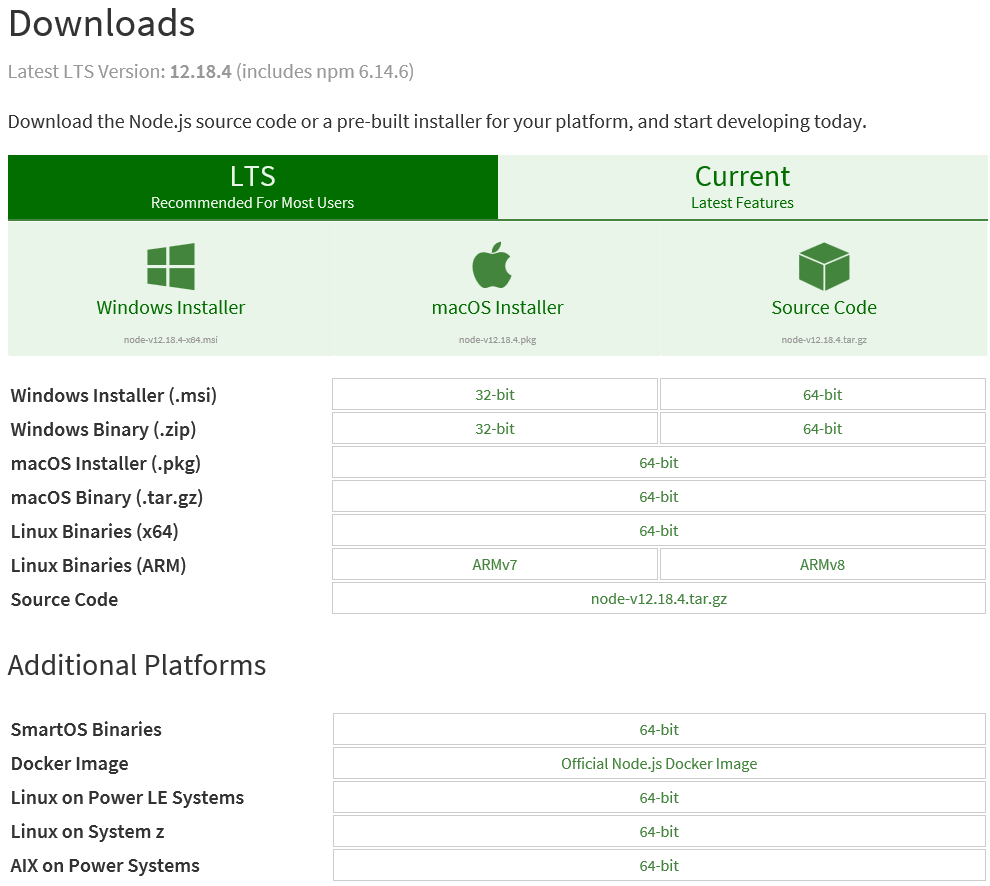

安装完成后，我们可以简单的进行验证安装是否正常；

    ## 查看node版本
    $ node -v
	v14.9.0
    
    ## 查看npm版本
    $ npm -v
    6.14.8

    ##设置缓存文件夹
    $ npm config set cache "D:\Nodejs\node_cache"
	　
    ##设置全局模块存放路径
    $ npm config set prefix "D:\Nodejs\node_global"

    ##基于Node.js 安装cnpm(淘宝镜像),淘宝的cnpm命令管理工具可以代替默认的npm管理工具
    $ npm install -g cnpm --registry=https://registry.npm.taobao.org

    ##安装全局vue-cli脚手架,用于帮助搭建所需的模板框架
    $ cnpm install -g @vue/cli
    或者
    $ npm install -g @vue/cli

    ## 验证vue-cli脚手架是否安装完成
    $ vue -V
	@vue/cli 4.3.1

**说明：**

- node.exe是node.js的运行环境，类似java的java.exe；
- npm用于管理nodejs组件包的下载和依赖关系包的下载，类似于java的maven或者是python的pip工具；
- 单独设置cache和global的文件夹的目的是为了修改默认存放位置，现在很多工具都把下载内容放在C盘的User目录下，如果你的nodejs安装路径不在C盘，你的C盘也不想那么大的话，尽可能设置一下；设置成功后，之后用命令npm install XXX -g安装以后模块就在D:\Nodejs\node_global里了；
- 由于国内外网络原因，尽量在安装完成后设置npm的国内镜像代理，加快下载速度，国内最常用的就是淘宝镜像

#### 1.2 创建工程

1、创建工程

    ## 创建工程
    vue create reseau-ui

2、选择搭建方式，通过键盘上下左右键选择预设的工具集，由于第一次搭建没有预设，选择手动选项，即下图中最下面的选项【Manually select features】，然后回车；

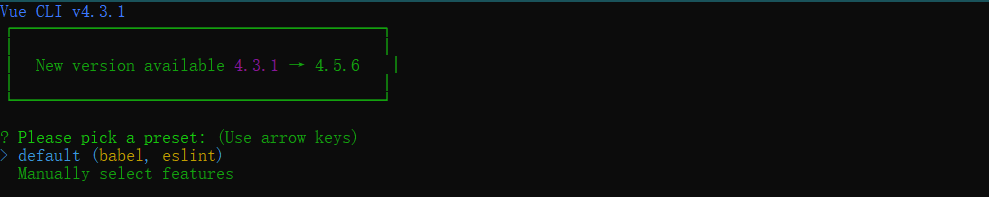

3、手动选择工程特性 (上下键移动光标，空格键选中或反选，选择完成后，回车)

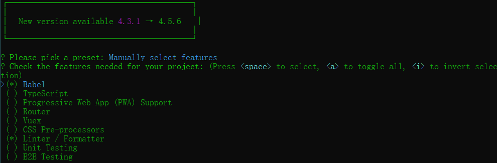

如上图所示，工程特性分别解释一下：

- Babel 必选，因为该组件是编译器，用于将编写的ES6代码编译成浏览器能识别的JavaScript代码，是核心组件包
- Typescript 微软开发的一种编程语言，通过Babel能够变异成JavaScript，可选，一般来讲，初级开发不建议用，增加学习成本
- Progressive Web App (PWA) Support 浏览器支持的小程序，一般不用
- Router 路由组件，用于单页面程序组件之间的页面跳转路由，必选
- Vuex 存储框架，建议选用
- CSS Pre-processors CSS预处理工具，支持SASS，LESS等预编译语言，用于增强编码时css的能力，最终这些内容会被预处理工具变异成css，必选
- Linter / Formatter 代码规范检查工具，可选
- Unit Testing 单元测试框架 可选
- E2E Testing 端对端测试框架，用于支持自动化测试，可选

4、选择css预处理器

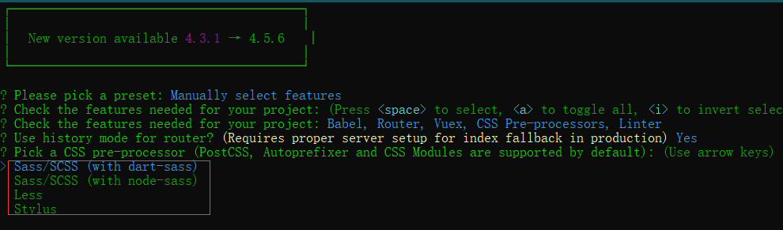

一般来讲，由于element-ui和bootstrap等框架都选择了sass，所以建议新工程还是可以考虑采用SASS，这里的dart-sass和node-sass通常选择dart-sass，因为运行速度还可以，新特性较多，安装简便
当然，如果对于LESS比较熟悉，也可以选择Less
选择完后回车

5、ESLint配置

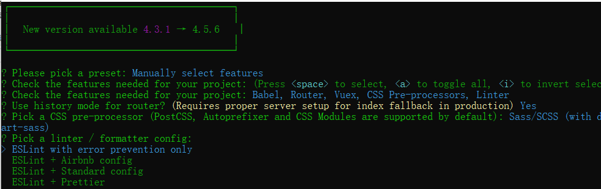

如果选择了ESLint，会出现该步骤，通常选择第一个选项，语法出错提示，这样对代码规范性要求较低，否则一堆报错。

6、选择语法检查方式

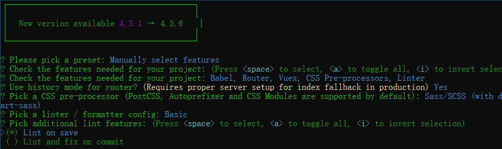

 - Lint on save 保存就检测
 - Lint and fix on commit  fix和commit时候检查

7、配置文件位置设置

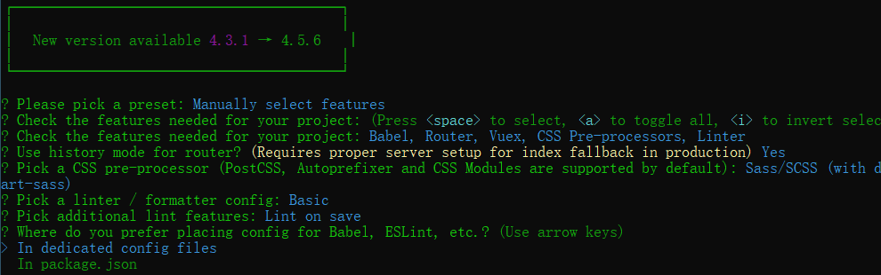

Babel，ESLint等是独立配置文件存在还是放在package.json文件里面，通常选择独立文件存在，这样好配置，否则，package.json文件很大，难以查找。

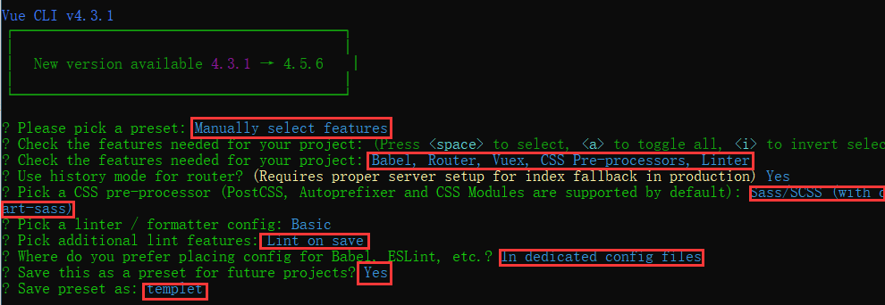

整个配置如上图所示，这个过程很复杂，但是整个过程可以存为一个配置，今后建立工程直接选择该配置，一步到位，不用再经历这么复杂的选择过程了，选择y，回车，然后输入一个名字，就是你的预设名字(如：templet)。

#### 1.3 结构说明

8、根目录结构说明

在以上步骤执行完成后，我们的项目框架就已经生成好了，如下图：

- bulid：最终发布代码的存放位置，初始项目时没有该目录，在后续编译发包后产生
- config：配置目录，包括端口号等；默认情况下不产生，后续根据需要添加
- node_modules：是所有本地依赖包的存放所在，今后所有npm install --save-dev所安装的包，都在该目录下
- public：该目录存储了项目启动的入口文件index.html以及favicon.ico
- src：源码所在路径，这里才是真正的源码所在，我们开发项目文件的存放目录
- package.json 项目配置文件。

9、src目录结构说明

为了将项目组件或功能结构清晰化，通常我们会在src文件夹下新建一些目录用来存放这些特性文件，这个并没有强制要求，通常只是根据项目的需要来定义，这里也仅仅只是做个参考，结构如下图：

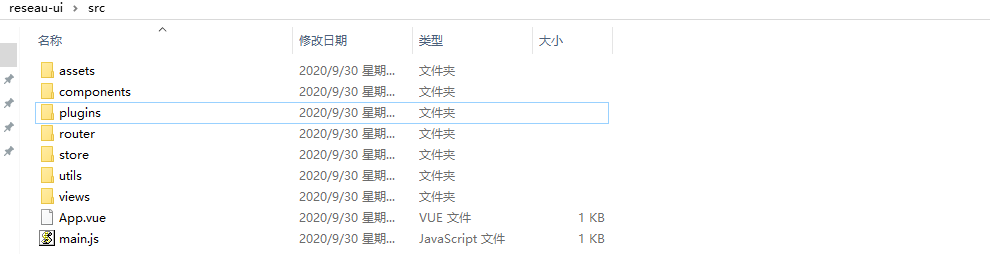

- assets 放置静态文件，比如图片
- components 存放了一个组件文件，可以不用
- plugins 存放插件 比如 element
- router 其中包喊router.js，项目的路由
- utils 项目工具包文件
- views 项目vue页面
- App.vue: 项目入口文件，我们也可以直接将组件写这里，而不使用 components 目录
- main.js 文件的作用是创建vue实例。初始项目中，引入了vue、app、store、router，当然我们也可以在此引入更多的东西或做一些全局的处理工作

10、build目录结构说明

build文件夹主要是webpack的配置，主要启动文件是dev-server.js，当我们输入npm run dev首先启动的就是dev-server.js，它会去检查node及npm版本，加载配置文件，启动服务。

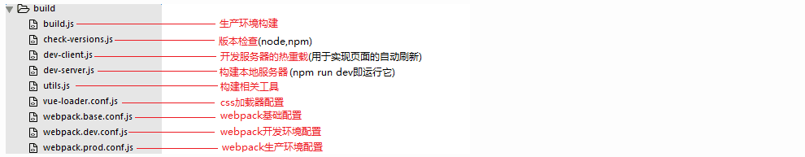

11、config目录结构说明

config文件夹主要是项目相关配置，我们常用的就是当端口冲突时配置监听端口，打包输出路径及命名等。

12、项目启动

至此，关于Vue项目的搭建以及文件相关说明就已经了解得差不多了，我们也该启动项目看看效果了；执行如下命令：

	## 进入项目目录
	$ cd reseau-ui

	## 启动项目
	$ npm run serve

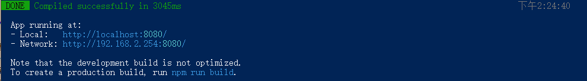

浏览器地址栏输入：[http://localhost:8080/](http://localhost:8080/ "http://localhost:8080/")

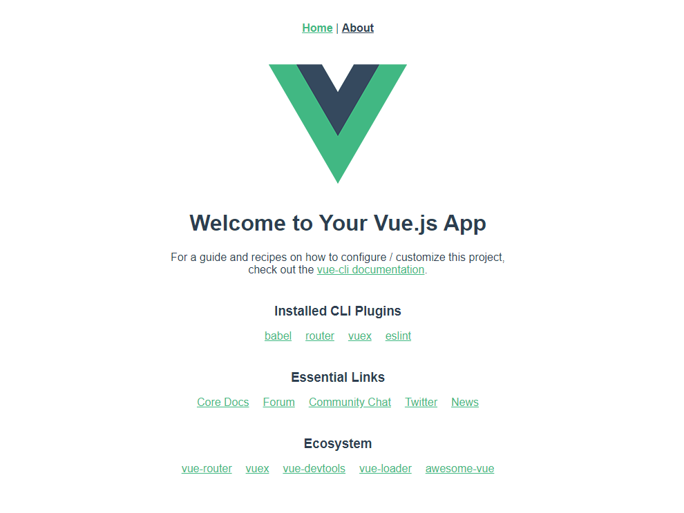

出现如上图所示页面，则表示我们的额项目搭建成功。

### 第二章：登陆页面

#### 2.1 添加依赖

	## 添加 element，一个 element 风格的 UI 框架
	vue add element 
	
	## 安装 axios，用于网络请求
	npm install axios 

	## 安全性的查询字符串解析和序列化字符串的库
	npm install qs
	
	## 安装 Vuex，用于管理状态
	npm install vuex --save
	
	## 安装 路由，用于实现两个 Vue 页面的跳转
	npm install vue-router

根据章节一内容，我们在src目录下新建如下目录用来存放特性文件。

	api (网络请求接口包)
	router (路由配置包)
	store (Vuex 状态管理包)
	utils (工具包)
	views (vue 视图包，存放所有 vue 代码，可根据功能模块进行相应分包)

整体项目结构如下图所示：

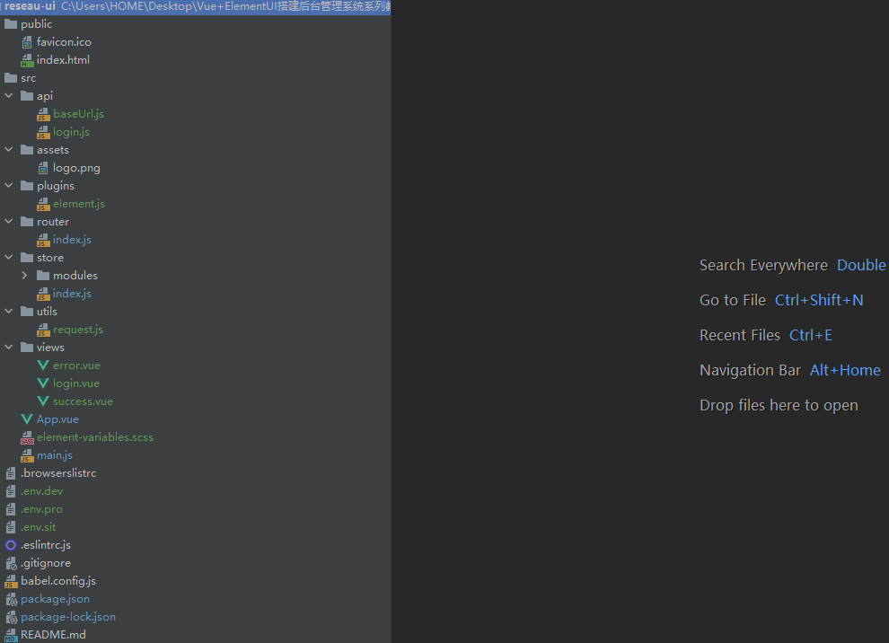

#### 2.2 添加页面

在src/views目录下新增三个 vue 文件：success.vue(登录成功页面)、error.vue(登录失败页面)，login.vue(登录页面)

success.vue 页面代码如下：

	<template>
	  

	    <h1>Welcome：{{ msg }}</h1>
	  

	</template>
	
	
	
	

error.vue 页面代码如下：

	<template>
	  

	    <h1>登录错误：{{ msg }}</h1>
	  

	</template>
	
	
	
	

login.vue 页面代码如下：

	<template>
	  

	    <el-card class="login-form-layout">
	      <el-form autocomplete="on" :model="loginForm" ref="loginForm" label-position="left">
	        <h2 class="login-title color-main">登陆入口</h2>
	        <el-form-item prop="username">
	          <el-input
	              name="username" type="text" v-model="loginForm.username"
	              autocomplete="on" placeholder="请输入用户名">
	          </el-input>
	        </el-form-item>
	        <el-form-item prop="password">
	          <el-input
	              name="password" :type="pwdType" v-model="loginForm.password"
	              @keyup.enter.native="handleLogin" autocomplete="on" placeholder="请输入密码">
	          </el-input>
	        </el-form-item>
	        <el-form-item style="margin-bottom: 60px">
	          <el-button
	              style="width: 100%"
	              type="primary"
	              :loading="loading"
	              @click.native.prevent="handleLogin">登录
	          </el-button>
	        </el-form-item>
	      </el-form>
	    </el-card>
	  

	</template>
	
	
	
	

代码说明:

    
    
scoped 对局部有效，如果去掉的化，全局有效
    
vh : 可视区百分百比  100vh  整个可视区  50vh 可视区的一半

autocomplete 属性规定输入字段是否应该启用自动完成功能。

自动完成允许浏览器预测对字段的输入。当用户在字段开始键入时，浏览器基于之前键入过的值，应该显示出在字段中填写的选项。

禁止浏览器表单自动填充
普通文本框添加 autocomplete="off"，密码输入框添加 autocomplete="new-password"。

    <input type="text" autocomplete="off" name="userName"/>
    <input type="password" autocomplete="new-password" name="password"/>

如果是整个表单可以设置：

    <form method="post" action="/form" autocomplete="off">
    ...
    </form>

@click-native-prevent

1.在封装好的组件上使用，所以要加上.native才能click

2.prevent就相当于..event.preventDefault()

所以@click.native.prevent是用来阻止默认行为的 ;

this.$store.dispatch() 与 this.$store.commit()方法的区别

commit是同步操作，dispatch:是异步操作，当操作行为中含有异步操作，比如向后台发送请求获取数据，就需要使用action的dispatch去完成了。
其他使用commit即可。

其他了解：commit=>mutations,用来触发同步操作的方法。
dispatch =>actions,用来触发异步操作的方法。在store中注册了mutation和action，在组件中用dispatch调用action，然后action用commit调用mutation

【commit存储】
this.$store.commit('方法名',值)
this.$store.commit('initUserInfo',friend);

【dispatch存储】
this.$store.dispatch('方法名',值)
this.$store.dispatch('initUserInfo',friend);

【commit取值】
this.$store.state.方法名
this.$store.state.userInfo;

【dispatch取值】
this.$store.getters.方法名
this.$store.getters.userInfo;

this.$store.dispatch('Login', this.loginForm)来调取store里的user.js的login方法，从而要更新

#### 2.3 添加router路由

页面写好了，我们需要依次显示这三个页面，这里我们统一使用[路由](https://router.vuejs.org/zh/ "路由")来管理显示页面。

##### 2.3.1 创建路由配置文件

在刚才建立的 router 文件夹下创建一个 index.js 文件，内容如下：

	import Vue from 'vue' // 引入Vue
	import VueRouter from 'vue-router' // 引入路由
	
	Vue.use(VueRouter) // 安装插件
	
	// 定义路由映射
	const routes = [
	  //配置默认的路径，默认显示登录页
	  { path: '/', component: () => import('@/views/login')},
	
	  //配置登录成功页面，使用时需要使用 path 路径来实现跳转
	  { path: '/success', component: () => import('@/views/success')},
	
	  //配置登录失败页面，使用时需要使用 path 路径来实现跳转
	  { path: '/error', component: () => import('@/views/error'), hidden: true }
	
	]
	
	const router = new VueRouter({
	  mode: 'history',
	  base: process.env.BASE_URL,
	  routes
	})
	
	export default router

##### 2.3.2 将路由添加到程序入口

路由配置文件写好，我们需要把他引入到 main.js 中，在项目的 src 目录根节点下，找到 main.js，添加内容如下：

	import Vue from 'vue'
	import App from './App.vue'
	import router from './router' // 引入路由配置
	import './plugins/element.js'
	
	// 阻止启动生产消息
	Vue.config.productionTip = false
	
	new Vue({
	  router, // 使用路由配置
	  render: h => h(App)
	}).$mount('#app')
	
对于src目录，我们在开发的过程中可以使用@替代src的路径，也就是说，在写路径的时候@就是指向src目录的。

##### 2.3.3 配置路由的出入口

现在路由已经完全引入到项目了，但是路由还需要一个出入口，这个出入口用来告诉路由将路由的内容显示在这里。上面 main.js 配置的第一个 vue 显示页面为 App.vue ，因此我们修改 App.vue 内容如下：

	<template>
	  

	    

	      <!-- 路由的出入口，路由的内容将被显示在这里 -->
	      <router-view/>
	    

	  

	</template>
	
	
	
	

现在保存 App.vue 文件后，当前项目会被重新装载运行，在刚才浏览的界面就会看到登录界面如下：

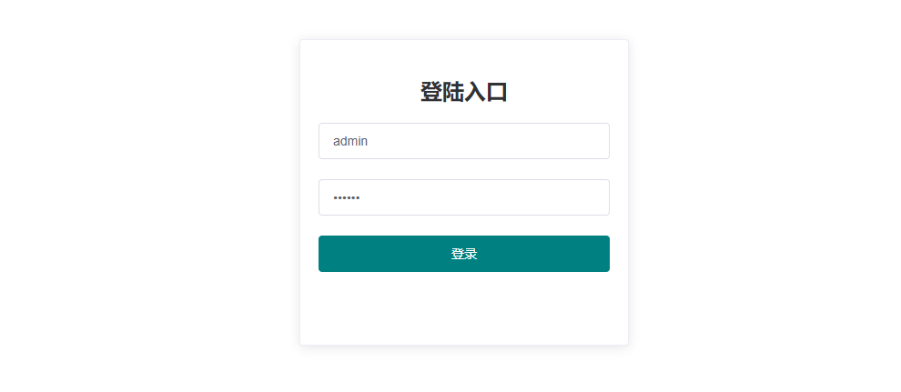

##### 2.3.4 路由跳转

在 login.vue 中可以使用 this.$router.push({path: "路径"}) 来跳转到指定路径的路由组件中，下面是通过路由跳转到 error.vue 与 success.vue的代码。

	if (code == 200) {
	  //跳转到成功页，并将参数传递到页面
	  this.$router.push({path: "/success", query: {data: response.data.data}});  
	} else {
         //跳转到失败页，并将参数传递到页面
	  this.$router.push({path: "/error", query: {message: response.data.message}}); 
	}

#### 2.4 使用 Vuex + Axios 网络请求

##### 2.4.1 设置通用BaseURL

Vue CLI3 中可以通过设置环境变量和模式，可以根据不同模式加载不同的 baseUrl 地址。

###### 2.4.1.1 环境变量

在 Vue 项目的根目录下可以创建以下文件来设置环境变量。

	.env                # 在所有的环境中被载入
	.env.local          # 在所有的环境中被载入，但会被 git 忽略
	.env.[mode]         # 只在指定的模式中被载入
	.env.[mode].local   # 只在指定的模式中被载入，但会被 git 忽略

环境变量文件，通常使用 “键=值” 的方式来设置一个环境变量

	FOO = bar
	VUE_APP_SECRET = secret

###### 2.4.1.2 使用环境变量

只有以 VUE_APP_ 开头的变量会被 webpack.DefinePlugin 静态嵌入到客户端侧的包中，从而在 Vue 的项目中使用，使用方式为：process.env.变量名

	process.env.VUE_APP_ENV

###### 2.4.1.3 模式

模式是 Vue CLI 项目中一个重要的概念。默认情况下，一个 Vue CLI 项目有三个模式，他们分别对应 Vue 项目中根目录的 package.json 文件的配置。

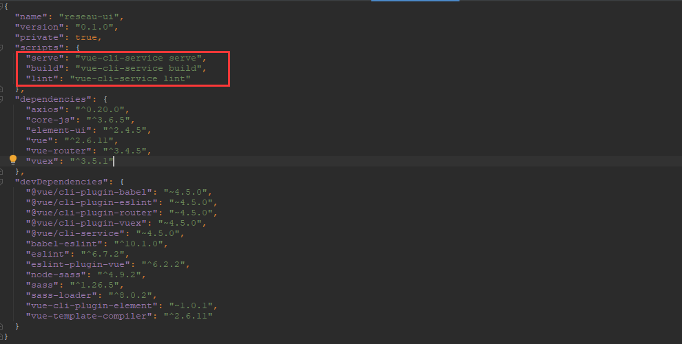

	development 模式用于 vue-cli-service serve
	production 模式用于 vue-cli-service build 和 vue-cli-service test:e2e
	test 模式用于 vue-cli-service test:unit

###### 2.4.1.3 配置自定义模式

环境变量与模式配置 baseUrl 根据不同模式加载不同 baseUrl，相应的每一个模式，又可以创建一个与之相对应的环境变量配置文件。

在 package.json 使用( --mode 模式名 )，即可定义一个模式，然后创建 .env.模式名 环境变量配置文件就会自动加载环境变量配置文件，使用自定义的模式加载 baseUrl。修改package.json文件如下：

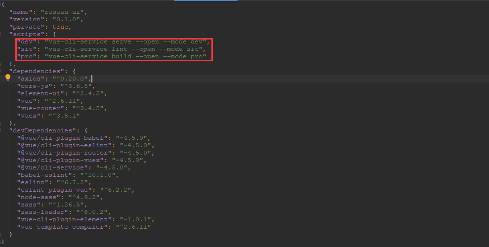

同时在 Vue 项目根目录创建下面三个环境变量配置文件(.env.dev  .env.sit  .env.pro)；

.env.dev 文件内容

	NODE_ENV = dev

.env.sit 文件内容

	NODE_ENV = sit

.env.pro 文件内容

	NODE_ENV = pro

在 api 文件夹下，创建一个通用地址的文件：baseUrl.js

	let baseUrl = "";
	switch (process.env.NODE_ENV) { //注意变量名是自定义的
	    case 'dev':
	        baseUrl = "http://localhost:8088/"  //开发环境url
	        break
	    case 'sit':
	        baseUrl = "http://localhost:8088/"  //测试环境url
	        break
	    case 'pro':
	        baseUrl = "http://localhost:8089/"   //生产环境url
	        break
	}
	
	export default baseUrl;

##### 2.4.2 Axios简述

Axios 是一个网络请求构架，官方推荐使用这种方式进行 http 的请求；在 utils 包下封装一个请求工具类 request.js

	import axios from 'axios' //引入 axios
	import baseUrl from '../api/baseUrl' //使用环境变量 + 模式的方式定义基础URL
	
	// 创建 axios 实例
	const service = axios.create({
	    baseURL: baseUrl, // api 的 base_url
	    timeout: 15000, // 请求超时时间
	})
	
	export default service

##### 2.4.3 登录请求接口 API

在 api 文件夹下，创建一个登录API文件：login.js

	import request from '@/utils/request' //引入封装好的 axios 请求
	
	export function login(username, password) { //登录接口
	    return request({ //使用封装好的 axios 进行网络请求
	        url: '/admin/login',
	        method: 'post',
	        data: { //提交的数据
	            username,
	            password
	        }
	    })
	}

#### 2.5 使用 Vuex 封装 Axios

Vuex 是一个专为 Vue.js 应用程序开发的状态管理模式。它采用集中式存储管理应用的所有组件的状态，并以相应的规则保证状态以一种可预测的方式发生变化。

###### 2.5.1 封装 Vuex 中的 module

在 store 文件夹下创建一个 modules 文件夹，然后在此文件夹下创建一个 user.js 文件

	import { login } from '@/api/login'//引入登录 api 接口
	
	const user = {
	    actions: {
	        // 登录,定义 Login 方法,在组件中使用 this.$store.dispatch("Login") 调用
	        Login({ commit }, userInfo) {
	            const username = userInfo.username.trim()
	            //封装一个 Promise
	            return new Promise((resolve, reject) => {
	                //使用 login 接口进行网络请求
	                login(username, userInfo.password).then(response => {
	                    //提交一个 mutation，通知状态改变
	                    commit('')
	                    //将结果封装进 Promise
	                    resolve(response) 
	                }).catch(error => {
	                    reject(error)
	                })
	            })
	        },
	    }
	}
	
	export default user

1. 首先引入 login 接口，之后使用登录接口进行网络请求。
2. 定义一个 名为 Login 的 action 方法，Vue 组件通过 this.$store.dispatch("Login") 调用
3. Promise，这个类很有意思，官方的解释是“store.dispatch 可以处理被触发的 action 的处理函数返回的 Promise，并且 store.dispatch 仍旧返回 Promise”。这话的意思组件中的 dispatch 返回的仍是一个 Promise 类，因此推测 Promise 中的两个方法 resolve() 与 reject() 分别对应 dispatch 中的 then 与 catch。

###### 2.5.2 创建 Vuex

在 store 文件夹下创建一个 index.js 文件

	import Vue from 'vue' //引入 Vue
	import Vuex from 'vuex' //引入 Vuex
	import user from './modules/user' //引入 user module
	
	Vue.use(Vuex)
	
	const store = new Vuex.Store({
	  modules: {
	    user //使用 user.js 中的 action
	  }
	})
	
	export default store

###### 2.5.3 将 Vuex 添加到程序入口

Vuex配置文件写好后，我们需要把他引入到 main.js 中，在项目的 src 目录根节点下，找到 main.js，添加内容如下：

	import Vue from 'vue'
	import App from './App.vue'
	import './plugins/element.js'
	import router from './router' // 引入路由配置
	import store from './store' //引入 Vuex 状态管理
	
	
	// 阻止启动生产消息
	Vue.config.productionTip = false
	
	new Vue({
	  router, // 使用路由配置
	  store, //使用 Vuex 进行状态管理
	  render: h => h(App)
	}).$mount('#app')

重新运行项目，在 Chrome 浏览器中进入调试模式，点击登录按钮。

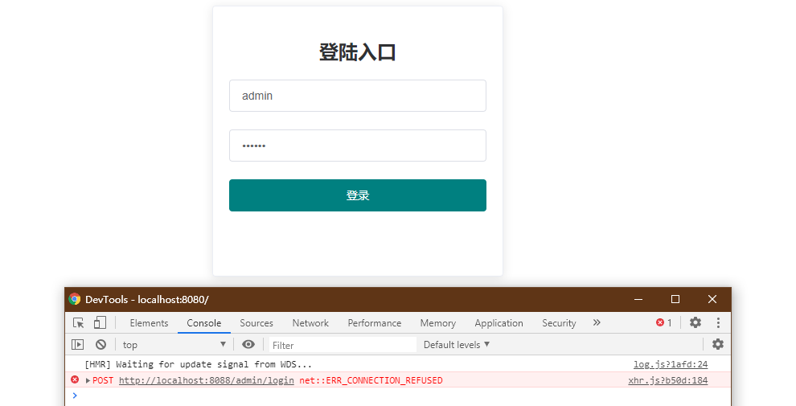

可以看到有发送一个 8088 端口的请求，至此 Vue 端的所有代码已经完成。

## 附录

### Axios详解

#### 什么是Axios

Axios 是一个基于promise的HTTP库，可以用在浏览器和nodejs中。

**特性：**

- 从浏览器中创建 XMLHttpRequests
- 从 node.js 创建 http 请求
- 支持 Promise API
- 拦截请求和响应
- 转换请求数据和响应数据
- 取消请求
- 自动转换 JSON 数据
- 客户端支持防御 XSRF

#### 安装Axios

使用npm安装：

	$ npm install axios

使用bower安装

	$ bower install axios

使用cdn引入：

	

#### Axios执行GET请求

	// 为给定 ID 的 user 创建请求
	axios.get('/user?ID=12345')
	  .then(function (response) {
	    console.log(response);
	  })
	  .catch(function (error) {
	    console.log(error);
	  });
	
	// 上面的请求也可以这样做
	axios.get('/user', {
	  params: {
	    ID: 12345
	  }
	}).then(function (response) {
	    console.log(response);
	  })
	  .catch(function (error) {
	    console.log(error);
	  });

#### Axios执行POST请求

	axios.post('/user', {
	    firstName: 'Fred',
	    lastName: 'Flintstone'
	  })
	  .then(function (response) {
	    console.log(response);
	  })
	  .catch(function (error) {
	    console.log(error);
	  });

#### Axios执行多个并发请求

	function getUserAccount() {
	  return axios.get('/user/12345');
	}
	
	function getUserPermissions() {
	  return axios.get('/user/12345/permissions');
	}
	
	axios.all([getUserAccount(), getUserPermissions()])
	  .then(axios.spread(function (acct, perms) {
	    // 两个请求现在都执行完成
	  }));

#### Axios API

可以通过Axios传递相关配置来创建请求，axios(url[,配置])，默认采用GET请求;

	## 发送 GET 请求（默认的方法）
	axios('/user/12345');

	## 定义配置
	let config = {
		method: 'post',
		url: '/login',
		data: {
			usercode: 'admin',
			userpasswd: '123456'
		}
	}
	## 发送请求
	axios(config);

	##  获取远端图片
	axios({
	  method:'get',
	  url:'http://bit.ly/2mTM3nY',
	  responseType:'stream'
	})
	  .then(function(response) {
	  response.data.pipe(fs.createWriteStream('ada_lovelace.jpg'))
	});

#### Axios别名请求

为方便起见，为所有支持的请求方法提供了别名

	axios.request(config)
	axios.get(url[, config])
	axios.delete(url[, config])
	axios.head(url[, config])
	axios.options(url[, config])
	axios.post(url[, data[, config]])
	axios.put(url[, data[, config]])
	axios.patch(url[, data[, config]])

**注意：**

在使用别名方法时， url、method、data 这些属性都不必在配置中指定。

#### Axios 并发

处理并发请求的助手函数

	axios.all(iterable)
	axios.spread(callback)

#### 创建实例

可以使用自定义配置新建一个 axios 实例，axios.create([config])；

	const instance = axios.create({
	  baseURL: 'https://some-domain.com/api/',
	  timeout: 1000,
	  headers: {'X-Custom-Header': 'foobar'}
	});

#### 实例方法

以下是可用的实例方法。指定的配置将与实例的配置合并。

	axios#request(config)
	axios#get(url[, config])
	axios#delete(url[, config])
	axios#head(url[, config])
	axios#options(url[, config])
	axios#post(url[, data[, config]])
	axios#put(url[, data[, config]])
	axios#patch(url[, data[, config]])

#### 请求配置

这些是创建请求时可以用的配置选项。只有 url 是必需的。如果没有指定 method，请求将默认使用 get 方法。

	{
	   // `url` 是用于请求的服务器 URL
	  url: '/user',
	
	  // `method` 是创建请求时使用的方法
	  method: 'get', // default
	
	  // `baseURL` 将自动加在 `url` 前面，除非 `url` 是一个绝对 URL。
	  // 它可以通过设置一个 `baseURL` 便于为 axios 实例的方法传递相对 URL
	  baseURL: 'https://some-domain.com/api/',
	
	  // `transformRequest` 允许在向服务器发送前，修改请求数据
	  // 只能用在 'PUT', 'POST' 和 'PATCH' 这几个请求方法
	  // 后面数组中的函数必须返回一个字符串，或 ArrayBuffer，或 Stream
	  transformRequest: [function (data, headers) {
	    // 对 data 进行任意转换处理
	    return data;
	  }],
	
	  // `transformResponse` 在传递给 then/catch 前，允许修改响应数据
	  transformResponse: [function (data) {
	    // 对 data 进行任意转换处理
	    return data;
	  }],
	
	  // `headers` 是即将被发送的自定义请求头
	  headers: {'X-Requested-With': 'XMLHttpRequest'},
	
	  // `params` 是即将与请求一起发送的 URL 参数
	  // 必须是一个无格式对象(plain object)或 URLSearchParams 对象
	  params: {
	    ID: 12345
	  },
	
	   // `paramsSerializer` 是一个负责 `params` 序列化的函数
	  // (e.g. https://www.npmjs.com/package/qs, http://api.jquery.com/jquery.param/)
	  paramsSerializer: function(params) {
	    return Qs.stringify(params, {arrayFormat: 'brackets'})
	  },
	
	  // `data` 是作为请求主体被发送的数据
	  // 只适用于这些请求方法 'PUT', 'POST', 和 'PATCH'
	  // 在没有设置 `transformRequest` 时，必须是以下类型之一：
	  // - string, plain object, ArrayBuffer, ArrayBufferView, URLSearchParams
	  // - 浏览器专属：FormData, File, Blob
	  // - Node 专属： Stream
	  data: {
	    firstName: 'Fred'
	  },
	
	  // `timeout` 指定请求超时的毫秒数(0 表示无超时时间)
	  // 如果请求话费了超过 `timeout` 的时间，请求将被中断
	  timeout: 1000,
	
	   // `withCredentials` 表示跨域请求时是否需要使用凭证
	  withCredentials: false, // default
	
	  // `adapter` 允许自定义处理请求，以使测试更轻松
	  // 返回一个 promise 并应用一个有效的响应 (查阅 [response docs](#response-api)).
	  adapter: function (config) {
	    /* ... */
	  },
	
	 // `auth` 表示应该使用 HTTP 基础验证，并提供凭据
	  // 这将设置一个 `Authorization` 头，覆写掉现有的任意使用 `headers` 设置的自定义 `Authorization`头
	  auth: {
	    username: 'janedoe',
	    password: 's00pers3cret'
	  },
	
	   // `responseType` 表示服务器响应的数据类型，可以是 'arraybuffer', 'blob', 'document', 'json', 'text', 'stream'
	  responseType: 'json', // default
	
	  // `responseEncoding` indicates encoding to use for decoding responses
	  // Note: Ignored for `responseType` of 'stream' or client-side requests
	  responseEncoding: 'utf8', // default
	
	   // `xsrfCookieName` 是用作 xsrf token 的值的cookie的名称
	  xsrfCookieName: 'XSRF-TOKEN', // default
	
	  // `xsrfHeaderName` is the name of the http header that carries the xsrf token value
	  xsrfHeaderName: 'X-XSRF-TOKEN', // default
	
	   // `onUploadProgress` 允许为上传处理进度事件
	  onUploadProgress: function (progressEvent) {
	    // Do whatever you want with the native progress event
	  },
	
	  // `onDownloadProgress` 允许为下载处理进度事件
	  onDownloadProgress: function (progressEvent) {
	    // 对原生进度事件的处理
	  },
	
	   // `maxContentLength` 定义允许的响应内容的最大尺寸
	  maxContentLength: 2000,
	
	  // `validateStatus` 定义对于给定的HTTP 响应状态码是 resolve 或 reject  promise 。
	 // 如果 `validateStatus` 返回 `true` (或者设置为 `null` 或 `undefined`)，promise 将被 resolve; 否则，promise 将被 rejecte
	  validateStatus: function (status) {
	    return status >= 200 && status < 300; // default
	  },
	
	  // `maxRedirects` 定义在 node.js 中 follow 的最大重定向数目
	  // 如果设置为0，将不会 follow 任何重定向
	  maxRedirects: 5, // default
	
	  // `socketPath` defines a UNIX Socket to be used in node.js.
	  // e.g. '/var/run/docker.sock' to send requests to the docker daemon.
	  // Only either `socketPath` or `proxy` can be specified.
	  // If both are specified, `socketPath` is used.
	  socketPath: null, // default
	
	  // `httpAgent` 和 `httpsAgent` 分别在 node.js 中用于定义在执行 http 和 https 时使用的自定义代理。允许像这样配置选项：
	  // `keepAlive` 默认没有启用
	  httpAgent: new http.Agent({ keepAlive: true }),
	  httpsAgent: new https.Agent({ keepAlive: true }),
	
	  // 'proxy' 定义代理服务器的主机名称和端口
	  // `auth` 表示 HTTP 基础验证应当用于连接代理，并提供凭据
	  // 这将会设置一个 `Proxy-Authorization` 头，覆写掉已有的通过使用 `header` 设置的自定义 `Proxy-Authorization` 头。
	  proxy: {
	    host: '127.0.0.1',
	    port: 9000,
	    auth: {
	      username: 'mikeymike',
	      password: 'rapunz3l'
	    }
	  },
	
	  // `cancelToken` 指定用于取消请求的 cancel token
	  // （查看后面的 Cancellation 这节了解更多）
	  cancelToken: new CancelToken(function (cancel) {
	  })
	}

#### 响应结构

某个请求的响应包含以下信息

	{
	  // `data` 由服务器提供的响应
	  data: {},
	
	  // `status` 来自服务器响应的 HTTP 状态码
	  status: 200,
	
	  // `statusText` 来自服务器响应的 HTTP 状态信息
	  statusText: 'OK',
	
	  // `headers` 服务器响应的头
	  headers: {},
	
	   // `config` 是为请求提供的配置信息
	  config: {},
	 // 'request'
	  // `request` is the request that generated this response
	  // It is the last ClientRequest instance in node.js (in redirects)
	  // and an XMLHttpRequest instance the browser
	  request: {}
	}

使用 then 时，你将接收下面这样的响应 :

	axios.get('/user/12345')
	  .then(function(response) {
	    console.log(response.data);
	    console.log(response.status);
	    console.log(response.statusText);
	    console.log(response.headers);
	    console.log(response.config);
	  });

#### 配置默认值

##### 全局的 axios 默认值

	## 全局设置超时时间
	axios.defaults.timeout = 10000;
	axios.defaults.baseURL = 'https://api.example.com';
	axios.defaults.headers.common['Authorization'] = AUTH_TOKEN;
	## 全局设置头部信息
	axios.defaults.headers.post['Content-Type'] = 'application/x-www-form-urlencoded;charset=UTF-8';

##### 自定义实例默认值

	// Set config defaults when creating the instance
	const instance = axios.create({
	  baseURL: 'https://api.example.com'
	});
	
	// Alter defaults after instance has been created
	instance.defaults.headers.common['Authorization'] = AUTH_TOKEN;

#### 配置的优先顺序

配置会以一个优先顺序进行合并。这个顺序是：在 lib/defaults.js 找到的库的默认值，然后是实例的 defaults 属性，最后是请求的 config 参数。后者将优先于前者。这里是一个例子：

	// 使用由库提供的配置的默认值来创建实例
	// 此时超时配置的默认值是 `0`
	var instance = axios.create();
	
	// 覆写库的超时默认值
	// 现在，在超时前，所有请求都会等待 2.5 秒
	instance.defaults.timeout = 2500;
	
	// 为已知需要花费很长时间的请求覆写超时设置
	instance.get('/longRequest', {
	  timeout: 5000
	});

#### 拦截器

在请求或响应被 then 或 catch 处理前拦截它们

	// 添加请求拦截器
	axios.interceptors.request.use(function (config) {
	    // 在发送请求之前做些什么,一般在这个位置判断token是否存在
	    return config;
	  }, function (error) {
	    // 对请求错误做些什么
	    return Promise.reject(error);
	  });
	
	// 添加响应拦截器
	axios.interceptors.response.use(function (response) {
	    // 对响应数据做点什么
	     // 处理响应数据
	    if (response.status === 200) {            
	        return Promise.resolve(response);        
	    } else {            
	        return Promise.reject(response);        
	    }
	  }, function (error) {
	    // 对响应错误做点什么
	    return Promise.reject(error);
	  });

如果你想在稍后移除拦截器，可以这样：

	const myInterceptor = axios.interceptors.request.use(function () {/*...*/});
	axios.interceptors.request.eject(myInterceptor);

可以为自定义 axios 实例添加拦截器

	const instance = axios.create();
	instance.interceptors.request.use(function () {/*...*/});

#### 错误处理

	axios.get('/user/12345')
	  .catch(function (error) {
	    if (error.response) {
	      // The request was made and the server responded with a status code
	      // that falls out of the range of 2xx
	      console.log(error.response.data);
	      console.log(error.response.status);
	      console.log(error.response.headers);
	    } else if (error.request) {
	      // The request was made but no response was received
	      // `error.request` is an instance of XMLHttpRequest in the browser and an instance of
	      // http.ClientRequest in node.js
	      console.log(error.request);
	    } else {
	      // Something happened in setting up the request that triggered an Error
	      console.log('Error', error.message);
	    }
	    console.log(error.config);
	  });

Y可以使用 validateStatus 配置选项定义一个自定义 HTTP 状态码的错误范围。

	axios.get('/user/12345', {
	  validateStatus: function (status) {
	    return status < 500; // Reject only if the status code is greater than or equal to 500
	  }
	})

#### 取消

使用 cancel token 取消请求。可以使用 CancelToken.source 工厂方法创建 cancel token，像这样：

	const CancelToken = axios.CancelToken;
	const source = CancelToken.source();
	
	axios.get('/user/12345', {
	  cancelToken: source.token
	}).catch(function(thrown) {
	  if (axios.isCancel(thrown)) {
	    console.log('Request canceled', thrown.message);
	  } else {
	     // 处理错误
	  }
	});
	
	axios.post('/user/12345', {
	  name: 'new name'
	}, {
	  cancelToken: source.token
	})
	
	// 取消请求（message 参数是可选的）
	source.cancel('Operation canceled by the user.');

还可以通过传递一个 executor 函数到 CancelToken 的构造函数来创建 cancel token：

	const CancelToken = axios.CancelToken;
	let cancel;
	
	axios.get('/user/12345', {
	  cancelToken: new CancelToken(function executor(c) {
	    // executor 函数接收一个 cancel 函数作为参数
	    cancel = c;
	  })
	});
	
	// cancel the request
	cancel();

**注意：** 可以使用同一个 cancel token 取消多个请求。

默认情况下，axios将JavaScript对象序列化为JSON。 要以application / x-www-form-urlencoded格式发送数据，您可以使用以下选项之一。

您可以使用qs库编码数据：

	const qs = require('qs');
	axios.post('/foo', qs.stringify({ 'bar': 123 }));

或者以另一种方式（ES6），

	import qs from 'qs';
	const data = { 'bar': 123 };
	const options = {
	  method: 'POST',
	  headers: { 'content-type': 'application/x-www-form-urlencoded' },
	  data: qs.stringify(data),
	  url,
	};
	axios(options);

在node.js中，您可以使用querystring模块，如下所示：

	const querystring = require('querystring');
	axios.post('http://something.com/', querystring.stringify({ foo: 'bar' }));

### Promise

#### Promise是什么？

- Promise是一个构造函数，所以可以 new 出一个Promise的实例；
- 在Promise上有两个函数 resolve (成功之后的回调函数)和 reject (失败后的回调函数)；
- 在Promise构造函数的prototype属性上，有一个 .then() 方法。所以只要是Promise构造函数创建的实例，都可以访问到 .then()方法；
- Promise表示一个一步操作，每当我们new一个Promise的实例，这个实例就代表具体的 异步 操作。
- Promise创建的实例，是一个异步操作，这个异步操作结果，只有两种结果：
 - 状态1：异步执行 成功，需要在内部调用成功的回调函数resolve把结果返回给调用者
 - 状态2：异步执行 失败，需要在内部调用失败的回调函数reject把结果返回调用者
- 由于Promise的实例是一个异步操作，所以内部拿到操作结果后，无法使用return把操作结果返回给调用者 ，这个时候只能使用 回调函数 的形式，把成功或失败的结果，返回给调用者，具体：我们可以在new出来的Promise实例上，调用 .then()方法，预先为这个Promise异步操作，指定成功(resolve)和失败(reject)回调函数。

#### 为什么会有promise

为了避免界面冻结（任务）

- 同步：假设你去了一家饭店，找个位置，叫来服务员，这个时候服务员对你说，对不起我是“同步”服务员，我要服务完这张桌子才能招呼你。那桌客人明明已经吃上了，你只是想要个菜单，这么小的动作，服务员却要你等到别人的一个大动作完成之后，才能再来招呼你，这个便是同步的问题：也就是“顺序交付的工作1234，必须按照1234的顺序完成”。
- 异步：则是将耗时很长的A交付的工作交给系统之后，就去继续做B交付的工作，。等到系统完成了前面的工作之后，再通过回调或者事件，继续做A剩下的工作。
AB工作的完成顺序，和交付他们的时间顺序无关，所以叫“异步”。

##### promise简单用法

	function2(){
	    // 你的逻辑代码 
	    return Promise.resolve(/* 这里是需要返回的数据*/)
	}
	
	function3(){
	    // 你的逻辑代码 
	    return Promise.resolve(/* 这里是需要返回的数据*/)
	}
	
	// 调用
	function1(){
	    this.function2().then(val => { 
	        this.function3();
	    });
	}

##### promise高阶用法

	init1(){
		return new Promise((resolve, reject) => {
		    let data={
		        dateStr:this.time
		    };
		    api.get('url', null).then( res => {
		       //自己的操作
		        resolve()
		    }).catch(err => {
		        reject()
		    });
		});
	};
	init2(){
		return new Promise((resolve, reject) => {
		    let data={
		        dateStr:this.time
		    };
		    api.get('url', null).then( res => {
		       //自己的操作
		        resolve()
		    }).catch(err => {
		        reject()
		    });
		});
	};
	
	
	//调用
	Promise.all([this.init1(),this.init2()]).then(() => {
	    //两个都调成功以后执行的操作
	//主要是loading问题
	}).catch(err => {
	    // 抛出错误信息
	});

#####　get请求

	export function get(url, params){    
	    return new Promise((resolve, reject) =>{        
	        axios.get(url, {            
	            params: params        
	        }).then(res => {
	            resolve(res.data);
	        }).catch(err =>{
	            reject(err.data)        
	        })    
	    });
	}

#####　post请求

	export function post(url, params) {
	    return new Promise((resolve, reject) => {
	         axios.post(url, qs.stringify(params))
	        .then(res => {
	            resolve(res.data);
	        })
	        .catch(err =>{
	            reject(err.data)
	        })
	    });
	}

使用方式：

在main.js中引入js

	import {get,post} from './utils/api'
	//将方法挂载到Vue原型上
	Vue.prototype.get = get;
	Vue.prototype.post = post;

配置请求环境
这里通过devServer请求代理
当在请求过程中有/api字符串会自动转换为目标服务器地址(target)

	devServer: {
	   historyApiFallback: true,
	   hot: true,
	   inline: true,
	   stats: { colors: true },
	   proxy: {
	     //匹配代理的url
	     '/api': {
	          // 目标服务器地址
	             target: 'http://v.juhe.cn',
	             //路径重写
	             pathRewrite: {'^/api' : ''},
	             changeOrigin: true,
	             secure: false,
	           }
	      },
	    disableHostCheck:true
	   }

这是请求聚合数据的接口为列子

	this.get('/toutiao/index?type=top&key=秘钥',{})
	    .then((res)=>{
	        if(res.error_code===0){
	            resolve(res);
	        }else{
	            //这里抛出的异常被下面的catch所捕获
	            reject(error);
	        }
	    })
	    .catch((err)=>{
	        console.log(err)
	    })

#### 使用promise

比如用户想请求url1接口完后再调url2接口

	var promise = new Promise((resolve,reject)=>{
	        let url1 = '/toutiao/index?type=top&key=秘钥'
	        this.get(url,{})
	        .then((res)=>{
	            resolve(res);
	        })
	        .catch((err)=>{
	            console.log(err)
	        })
	    });
	    promise.then((res)=>{
	        let url2 = '/toutiao/index?type=top&key=秘钥'
	        this.get(ur2,{})
	        .then((res)=>{
	            //只有当url1请求到数据后才会调用url2，否则等待
	            resolve(res);
	        })
	        .catch((err)=>{
	            console.log(err)
	        })
	    })

**Promise对象三种状态：**

- pending: 等待中，或者进行中，表示还没有得到结果
- resolved: 已经完成，表示得到了我们想要的结果，可以继续往下执行
- rejected: 也表示得到结果，但是由于结果并非我们所愿，因此拒绝执(用catch捕获异常)

这三种状态不受外界影响，而且状态只能从pending改变为resolved或者rejected，并且不可逆(顾名思义承诺的后的东西怎么又能返回呢)。在Promise对象的构造函数中，将一个函数作为第一个参数。而这个函数，就是用来处理Promise的状态变化

这里要注意，不管是then或者catch返回的都是一个新的Promise实例！而每个Primise实例都有最原始的Pending（进行中）到Resolve（已完成），或者Pending（进行中）到Reject（已失败）的过程

##### Promise基本用法

###### Promise.all()用法

	var p = Promise.all([p1, p2, p3]);

all()接受数组作为参数。p1,p2,p3都是Promise的实例对象，p要变成Resolved状态需要p1，p2，p3状态都是Resolved，如果p1,p2,p3至少有一个状态是Rejected，p就会变成Rejected状态

###### Promise.race()用法

	var p = new Promise( [p1,p2,p3] )

只要p1、p2、p3之中有一个实例率先改变状态，p的状态就跟着改变。那个率先改变的 Promise 实例的返回值，就传递给p的回调函数,p的状态就会改变Resolved状态

###### Promise resolve()用法

	Promise.resolve('foo')
	// 等价于
	new Promise(resolve => resolve('foo'))

有时需要将现有对象转为Promise对象，Promise.resolve方法就起到这个作用.

###### Promise reject()用法

	Promise.reject('foo')
	// 等价于
	new Promise(reject => reject('foo'))

Promise.reject(reason)方法也会返回一个新的 Promise 实例，该实例的状态为rejected。但是Promise.reject()方法的参数，会原封不动地作为reject的理由，变成后续方法的参数。这一点与Promise.resolve方法不一致。

### Vuex详解

https://vuex.vuejs.org/zh/
